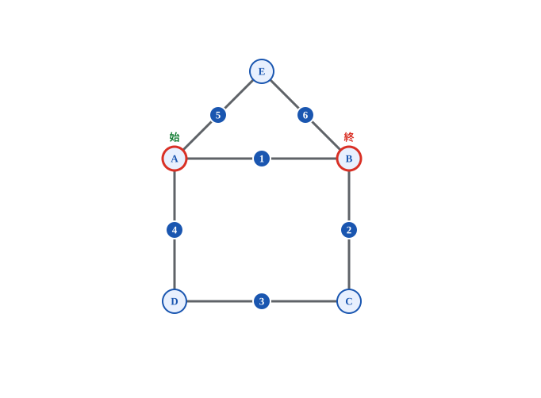

# 一筆書きパズルソルバー

画面上に点と線で図形を描くと、その図形が**一筆書きできるかどうかを自動で判定**し、
できる場合は**実際になぞる順番**まで教えてくれるデスクトップアプリです。

- 図形を編集するたびに、その場で「一筆書きできる／できない」と理由を表示します
- ［解答を探索］ボタンを押すと、各線に通過順の番号が付き、
  始点・終点のマークと「A → B → C → …」の順路が表示されます



> 画面例: 「家の形」を入力して探索したところ。線の上の青い丸が通過順、
> 「始」「終」がなぞり始め・なぞり終わりの点です。

---

## 目次

1. [動作環境](#動作環境)
2. [環境設定（Python のインストール）](#環境設定python-のインストール)
3. [アプリの入手](#アプリの入手)
4. [アプリの起動](#アプリの起動)
5. [画面の見方](#画面の見方)
6. [使い方](#使い方)
7. [チュートリアル: 「家の形」を解いてみる](#チュートリアル-家の形を解いてみる)
8. [一筆書きの豆知識](#一筆書きの豆知識)
9. [困ったときは](#困ったときは)
10. [開発者向け情報](#開発者向け情報)

---

## 動作環境

| 項目 | 内容 |
|---|---|
| OS | Windows 10 / 11（macOS・Linux でも動作します） |
| 必要なソフト | Python 3.10 以上（無料） |
| 追加ライブラリ | **不要**。Python さえ入れれば動きます |

## 環境設定（Python のインストール）

すでに Python が入っているか分からない場合は、先に
[困ったときは](#困ったときは) の「Python が入っているか確認する」を見てください。

1. ブラウザで公式サイトのダウンロードページを開きます:
   <https://www.python.org/downloads/>
2. 黄色い **「Download Python 3.x.x」** ボタンをクリックして、
   インストーラー（`python-3.x.x-amd64.exe`）をダウンロードします。
3. ダウンロードしたファイルをダブルクリックしてインストーラーを起動します。
4. **【重要】** 最初の画面の下にある
   **「Add python.exe to PATH」に必ずチェック**を入れてください。
   ここを忘れると、後でコマンドが認識されず起動できません。
5. 「Install Now」をクリックし、完了画面が出たら「Close」で閉じます。
6. 正しく入ったか確認します。
   - キーボードの **Windows キー + R** を押し、`cmd` と入力して Enter
     （黒い画面「コマンドプロンプト」が開きます）
   - 次のように入力して Enter:

     ```bat
     python --version
     ```

   - `Python 3.12.3` のようにバージョンが表示されれば準備完了です。

## アプリの入手

Git を知らなくても大丈夫です。ZIP でダウンロードできます。

1. このページ（GitHub のリポジトリ）右上あたりの緑色の **「Code」** ボタンをクリック
2. **「Download ZIP」** を選んでダウンロード
3. ダウンロードした `One_Stroke-main.zip` を右クリック → **「すべて展開」**
4. 展開してできたフォルダーの中に `gui_app.py` があることを確認してください

（Git を使える方は `git clone` でも構いません）

## アプリの起動

1. エクスプローラーで、`gui_app.py` があるフォルダーを開きます
2. ウィンドウ上部の**アドレスバー**（フォルダーの場所が表示されている欄）を
   クリックし、`cmd` と入力して Enter
   （そのフォルダーを開いた状態でコマンドプロンプトが起動します）
3. 次のように入力して Enter:

   ```bat
   python gui_app.py
   ```

4. 「一筆書きパズルソルバー」のウィンドウが開けば成功です。

> `python` で動かない場合は `py gui_app.py` を試してください。

## 画面の見方

```
┌────────────────────────────┬──────────────┐
│                            │  モード          │
│                            │  ◉ 点を追加      │
│                            │  ○ 線を追加      │
│      キャンバス（白い領域）      │  ○ 削除         │
│      ここに図形を描きます        │ ［解答を探索］    │
│                            │ ［全て消去］      │
│                            │  【使い方】…     │
├────────────────────────────┴──────────────┤
│ 解答: A → B → C → …        ← 探索結果の順路      │
│ 判定: 一筆書き可能です。…    ← 今の図形の判定（常時） │
└───────────────────────────────────────────┘
```

- **キャンバス**: クリックして点や線を描く場所。ウィンドウを広げると一緒に広がります
- **モード**: 右のパネルで「点を追加」「線を追加」「削除」を切り替えます
- **判定の行**: 図形を編集するたびに自動で更新されます。ボタンを押す必要はありません
- **点の色**: 青い縁が普通の点、**赤い縁は「奇数点」**（線が奇数本つながっている点）。
  オレンジは線を引くために選択中の点です

## 使い方

### 点を置く（モード: 点を追加）

- キャンバスの何もない場所をクリックすると点が置かれます。
  名前は A, B, C, … と自動で付きます（Z の次は AA, AB, …）
- **すでにある点をクリックすると名前を変更**できます（ダイアログが開きます）

### 線を引く（モード: 線を追加）

- 点を **2つ順番にクリック**すると、その2点を結ぶ線が引かれます
- 1つ目の点をクリックするとオレンジ色になります（選択中のしるし）
- やめたいときは何もない場所をクリックすると選択が解除されます
- 同じ点を2回クリックすると「自分自身への線は引けません」と警告が出ます
- **同じ2点の間に2本以上の線**も引けます。自動でカーブして重ならずに表示されます

### 消す（モード: 削除）

- **点をクリック** → その点と、つながっている線がまとめて消えます
- **線をクリック** → その線だけが消えます
- ［全て消去］ボタンを押すと、確認のうえで図形をすべて消します

### 解答を見る（［解答を探索］ボタン)

一筆書きできる図形なら、次の3つが表示されます。

1. 各線の真ん中に **青い丸の番号**（1, 2, 3, … の順になぞる)
2. なぞり始めの点の上に緑の「**始**」、なぞり終わりの点の上に赤の「**終**」
   （始点と終点が同じ図形では「始/終」と1つだけ表示）
3. 画面下に「**解答: A → B → …**」という点の順路

できない図形の場合は、理由（どの点が奇数点か、図形が離れている等）が
ダイアログで表示されます。

> **注意**: 解答が表示された後に図形を1か所でも編集すると、
> 解答は古くなるためいったん消えます。もう一度［解答を探索］を押してください。

## チュートリアル: 「家の形」を解いてみる

昔からある「これ一筆書きできる？」の定番、家の形を試してみましょう。

1. モードを **「点を追加」** にして、次のように5つの点を置きます
   - 四角形になるように4点（左上 A、右上 B、右下 C、左下 D）
   - 屋根のてっぺんになる位置（A と B の上あたり）に1点（E）
2. モードを **「線を追加」** にして、6本の線を引きます
   - A→B、B→C、C→D、D→A（四角形の4辺）
   - A→E、E→B（屋根の2辺)
3. このとき **A と B が赤い縁**になっているはずです（線が3本ずつ＝奇数点）。
   下の判定行には「一筆書き可能です。始点 A → 終点 B」と表示されます
4. **［解答を探索］** を押すと、線に 1〜6 の番号が付き、
   「解答: A → B → C → D → A → E → B」のような順路が表示されます
5. 表示どおりに指でなぞってみてください。ちゃんと一筆書きできます！

## 一筆書きの豆知識

このアプリの判定は「オイラーの定理」（1736年）に基づいています。

- **奇数点**（線が奇数本つながっている点）が **0個** → 一筆書きできる。
  どの点から始めても、最後は同じ点に戻ってくる（閉路）
- **奇数点が2個** → 一筆書きできる。ただし必ず**片方の奇数点から始めて、
  もう片方で終わる**
- **それ以外（奇数点が4個、6個、…）** → 絶対にできない
- 図形が2つ以上に**分かれている**場合もできない（ペンを紙から離せないため）

有名な「ケーニヒスベルクの橋の問題」（7つの橋をすべて1回ずつ渡れるか？）は
奇数点が4つあるため不可能——というのがオイラーの答えでした。
このアプリで再現して確かめることもできます。

## 困ったときは

### Python が入っているか確認する

コマンドプロンプト（Windows キー + R → `cmd` → Enter）で
`python --version` と入力して Enter。バージョンが表示されれば入っています。
`3.10` より古い場合はインストールし直してください。

### 「'python' は、内部コマンドまたは外部コマンド…として認識されていません」

インストール時に「Add python.exe to PATH」のチェックを忘れた可能性が高いです。

- まず `py gui_app.py` を試してください（多くの場合これで動きます）
- 駄目な場合は Python をアンインストールし、
  [環境設定](#環境設定python-のインストール) の手順4に注意してもう一度
  インストールしてください

### 「No module named 'tkinter'」と表示される

- **Windows**: 公式インストーラーで入れ直してください（標準で同梱されています）。
  インストーラーの「Customize installation」を選んだ場合は
  「tcl/tk and IDLE」にチェックが必要です
- **Ubuntu などの Linux**: `sudo apt install python3-tk` を実行してください
- **macOS**: <https://www.python.org/downloads/> の公式インストーラー版を
  使ってください

### 黒い画面（コマンドプロンプト）を閉じてしまった

アプリのウィンドウも一緒に閉じます。もう一度
[アプリの起動](#アプリの起動) の手順からやり直してください。

### 点や線がクリックしにくい

- 点は中心から約19ピクセル、線は曲線から6ピクセル以内が反応範囲です
- 点と線が重なっている場所では**点が優先**されます。
  線だけ消したいときは、点から離れた線の部分をクリックしてください

## 開発者向け情報

| ファイル | 役割 |
|---|---|
| `graph_logic.py` | ロジック層。グラフ管理・オイラー路の判定と探索（tkinter 非依存） |
| `gui_app.py` | GUI 層。エントリポイント（`python gui_app.py` で起動） |
| `test_graph_logic.py` | ロジック層の単体テスト（unittest） |
| `docs/SPEC.md` | 仕様書（実装の正） |

- 判定はオイラーの定理（連結 かつ 奇数点が0個または2個）、
  探索は Hierholzer 法のスタック反復実装（O(V+E)、多重辺対応）です
- テストの実行:

  ```bat
  python -m unittest test_graph_logic -v
  ```

- 外部ライブラリは使用していません（標準ライブラリのみ）。
  詳細な仕様は [docs/SPEC.md](docs/SPEC.md) を参照してください
